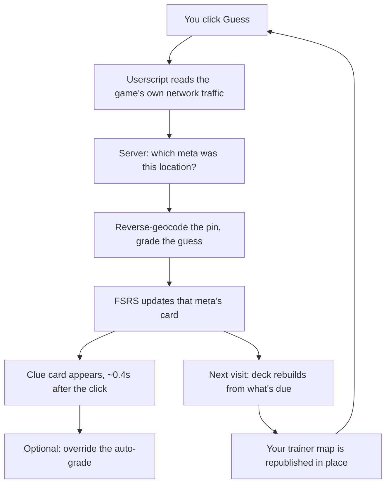

# GeoTrainer

Spaced repetition for GeoGuessr, built on top of the rounds you were going to play anyway.

It watches your games, works out which meta each round was testing, grades your guess against it, and rebuilds your practice map around the clues you're on the verge of forgetting.

## The problem

GeoGuessr is a memory game wearing a geography costume. Almost everything that separates a good player from a lucky one is recall: Alberta's bollards, the extra bar on a Nusa pole, which countries paint dashed yellow centre lines. These are called *metas*, and there are thousands of them.

[Learnable Meta](https://learnablemeta.com) already solved the teaching half of this, beautifully. You finish a round, and a note appears explaining exactly which clue you were meant to spot. Thousands of locations, hand-annotated. It's the best meta resource that exists.

But it has no memory of *you*. Every round is taught to a blank slate. So the loop goes:

1. See a meta you don't know. Get it wrong.
2. Read the note. Nod. Genuinely learn it.
3. See it again ten minutes later. Nail it. Feel like a genius.
4. Don't see it again for three weeks.
5. See it again. Blank completely.

Meanwhile you keep getting served Norwegian bollards you've known cold since March, because nothing anywhere is tracking that you know them. The teaching is excellent and the scheduling is nonexistent, so the practice you get is uncorrelated with the practice you need.

Anki solved this in 2006. The trick is that nobody wants to sit and grind flashcards about bollards — they want to play GeoGuessr.

## The idea

Make the round *be* the flashcard.

You play normally. Every guess is silently a review: the system knows which meta the location belongs to, so where your pin lands is the grade. Get it right, the card's interval stretches out. Get it wrong, it comes back tomorrow. Then it builds you a GeoGuessr map containing exactly the metas that are due, and hands it back to you as a normal game.

No extra app to open. No self-reporting. You just play, and the game quietly becomes a curriculum.

## What actually happens when you play



The clue card shows up while the score is still counting up, which matters more than it sounds — the explanation has to land while you still remember what you were looking at.

The deck rebuild is the part people don't expect: the server picks the due metas and their coordinates, then the userscript drives GeoGuessr's own map-maker API with your session cookies to publish them into a real map in your library. It's a normal GeoGuessr map. You can play it from the app, share it, ignore it.

## Does it work?

Here's my own log, 605 rounds across 216 distinct metas and 98 countries:

| Times I'd seen that meta before | Times I identified it correctly |
| --- | --- |
| First time ever | **16%** &nbsp; <sub>(35/216)</sub> |
| Second time | **37%** &nbsp; <sub>(46/126)</sub> |
| Third time or later | **60%** &nbsp; <sub>(127/212)</sub> |

Country-level accuracy across all of it: 81%.

Obvious caveat, stated plainly: this is one person's log, not a study. First exposures are unfamiliar by definition, so some of that climb is just regression to the mean. But the shape is the shape, and it's visible after three days rather than three months, which is the part I actually care about.

## How it's put together

| Piece | What it is |
| --- | --- |
| `coach/geocoach.user.js` | Tampermonkey script. Captures rounds, renders the clue card, publishes the trainer map. |
| `cloud/src/worker.mjs` | Cloudflare Worker + D1. Grading, state, deck building. What the userscript talks to. |
| `coach/server.mjs` | The same pipeline as a local Node server, for offline work and full-resolution dossiers. |
| `coach/scheduler.mjs` | The FSRS layer, on [ts-fsrs](https://github.com/open-spaced-repetition/ts-fsrs). Pure functions, no clock reads, so old rounds can be replayed. |
| `site/`, `dashboard/` | React + Vite front end. Three.js globe, retention stats, per-country breakdown. |
| `coach/catalog/` | Learnable Meta's map catalogs, bundled at deploy time so meta lookup needs no round trip. |

Per-user state is about 70KB of JSON: one FSRS card per meta, accuracy counters, country stats, confusion pairs. That's the whole backend, really. The deck isn't stored anywhere — it's recomputed from the cards whenever you need one.

Zero LLM calls anywhere in the system, deliberately. It's a scheduler, not a chatbot.

## Running it

```bash
npm install
node coach/server.mjs          # local bridge on :5177
npm run dev                    # dashboard
```

Then install `coach/geocoach.user.js` in Tampermonkey. On first run it mints a trainer map in your GeoGuessr library automatically; after that it keeps republishing that same map in place.

The cloud deployment (Worker + D1) is optional and only exists so progress survives the laptop being shut. `cloud/wrangler.jsonc` has the shape of it.

## Things that took embarrassingly long to work out

**The original round detector was starting my rounds for me.** It polled `/api/v3/games/<token>` every four seconds to notice when a new round began. Turns out a bare GET on that endpoint doesn't *read* the game, it *serves the next round* — including starting its timer. So sitting on the results screen was burning clock on a round I hadn't opened yet. The fix was to stop asking entirely and passively read the responses the page already fetches.

**Publishing a map is two calls, and the docs say one.** You can PUT a perfectly valid draft with all your coordinates, get a 200 back, and watch absolutely nothing change. Draft edits don't go live until you PUT an empty `{}` to `/publish`.

**A pin four kilometres from the flag graded as wrong for weeks.** The Vientiane meta is scoped to the Vientiane region, and the reverse geocoder returns the Lao romanization, `Viangchan`. String comparison, no match, wrong answer, card knocked back into relearning. The lesson generalises: region scopes have to be written in the geocoder's vocabulary, not the atlas's.

**Getting the clue card under half a second took three separate fixes**, because there were three separate problems stacked: the userscript's HTTP transport was adding ~900ms, the server was doing its database reads serially, and the meta lookup was cold on every round. Fixed with a synchronous fetch tap installed at document-start, parallel reads, and a prewarm fired the moment a round is served — about 60 seconds before you'll actually guess. 4.2s down to 0.4s, most of which is now GeoGuessr's own scoring response.

**GeoGuessr serves fresh games from stale map versions.** Which quietly defeated the first version of that prewarm, since it was warming the wrong locations. Hence prewarming on round start rather than deck rebuild.

## Credit

This is a layer on other people's work and it's worth being specific about whose.

[Learnable Meta](https://learnablemeta.com) — trausi's maps and annotations, plurk's userscript, likeon's platform — is the reason any of this is possible. The hard, unglamorous, years-long part is curating thousands of locations and knowing what each one is teaching. Scheduling on top of that is the easy bit. Their code is open at [likeon/geometa](https://github.com/likeon/geometa).

[Plonk It](https://www.plonkit.net) is the reference guide the round dossiers pull from. That snapshot is gitignored here — it's their content, not mine.

Scheduling is [ts-fsrs](https://github.com/open-spaced-repetition/ts-fsrs), an implementation of [FSRS](https://github.com/open-spaced-repetition/free-spaced-repetition-scheduler).
