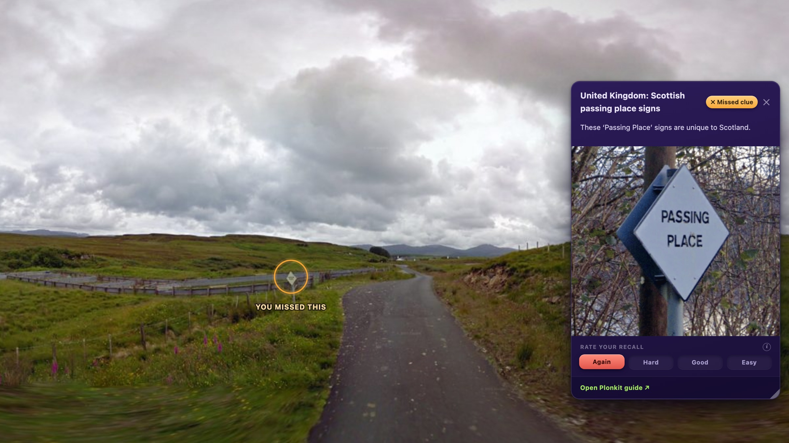
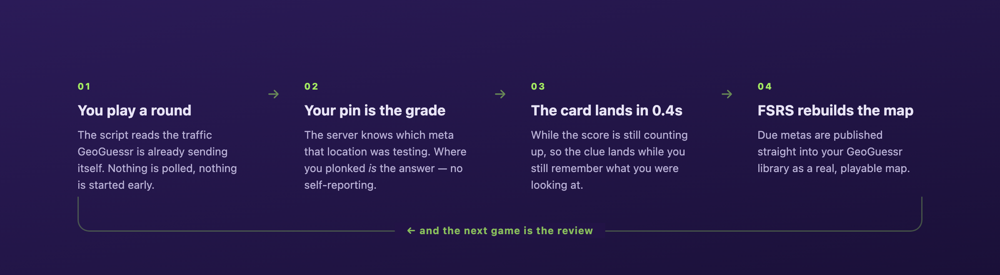

<h1 align="center">GeoTrainer</h1>

<p align="center"><b>Spaced repetition for GeoGuessr.</b> It grades the rounds you already play, then rebuilds your practice map out of the clues you're closest to forgetting.</p>

<p align="center">
  
  
  
</p>

<p align="center"></p>

<p align="center"><sub>A real round. I guessed Wales; it was Skye. The sign that gives it away is circled (by me, not by the card).</sub></p>

## Why

GeoGuessr is a memory game. The clues are called metas, there are thousands of them, and [Learnable Meta](https://learnablemeta.com) already explains every one beautifully the second your round ends.

Then it forgets you. You learn a meta, nail it ten minutes later, feel great, and don't see it again for three weeks. By then it's gone. Meanwhile you keep drawing Norwegian bollards you've known cold since March.

So I made the round the flashcard. Where your pin lands is the grade.

<p align="center"></p>

## Does it work

605 rounds, my own log:

| Times I'd seen that meta | I got it right |
| --- | --- |
| First time ever | **16%** &nbsp;<sub>35/216</sub> |
| Second time | **37%** &nbsp;<sub>46/126</sub> |
| Third time or later | **60%** &nbsp;<sub>127/212</sub> |

One player's data, so treat it as a hint rather than evidence. Some of that climb is just first exposures being unfamiliar by definition. Three days in, though, the shape was already there.

## Run it

```bash
npm install
node coach/server.mjs   # local bridge on :5177
npm run dev             # dashboard
```

Then install `coach/geocoach.user.js` in Tampermonkey. That's the install. It mints a trainer map in your GeoGuessr library on first run and republishes that same map from then on. The Cloudflare Worker is optional; it exists so progress survives the laptop shutting.

<details>
<summary>Three things that took embarrassingly long to work out</summary>

<br>

**The round detector was starting my rounds for me.** It polled `/api/v3/games/<token>` to spot new rounds. That endpoint doesn't read a game, it *serves the next one*, timer running. I was burning clock while sitting on the results screen. The fix was to stop asking and passively read what the page already fetches.

**Publishing a map takes two calls and looks like it takes one.** You can PUT a valid draft, get a 200 back, and watch nothing happen. Draft edits stay invisible until you PUT an empty `{}` to `/publish`.

**A pin 4km from the flag graded wrong for weeks.** The Vientiane meta is scoped to the Vientiane region; my geocoder returns the Lao romanization, `Viangchan`. Region scopes have to be spelled the way the geocoder spells them.

</details>

## Credit

[Learnable Meta](https://learnablemeta.com) does the hard part (trausi's maps, plurk's userscript, likeon's [platform](https://github.com/likeon/geometa)): thousands of hand-curated locations, each tagged with what it teaches. Scheduling on top of that is the easy bit. [Plonk It](https://www.plonkit.net) is what the round dossiers quote; that snapshot is gitignored, since it's their content. Scheduling is [ts-fsrs](https://github.com/open-spaced-repetition/ts-fsrs).
